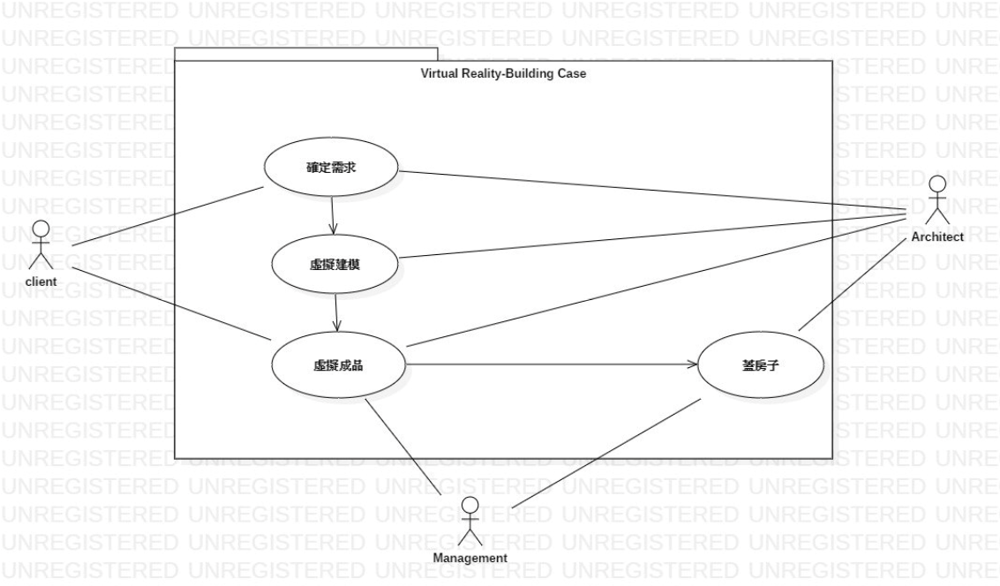
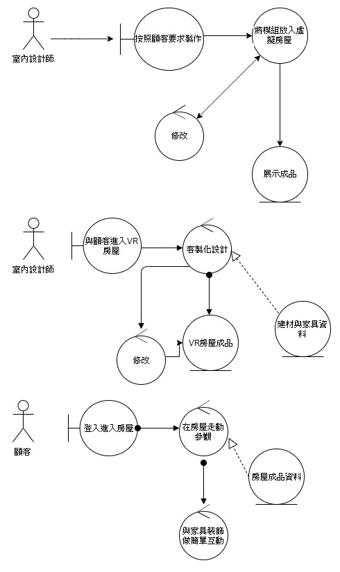
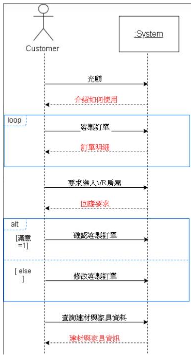

>1.專題題目
>>+ 房屋虛擬機

>2.文字敘述專題需求
>>利用VR來幫助客戶進行個人的房屋設計

>3.寫出專題之功能性需求與非功能性需求
>>專題之功能性需求
>>+ 3D化設計
>>+ 較為逼真
>>+ 可隨時修改

>>專題之非功能性需求
>>+ 操作性：系統能夠整合能調度的建材
>>+ 安全：只有建商跟客戶才有權利看到紀錄
>>+ 政策性：必須遵循我國建築業的標準

>4.畫出 使用案例圖 (use case diagram)
>>
>>

>5.由上而下 排出 使用案例的重要性
>>+ 可立即對房型進行修改
>>+ 查詢家具建材物的詳細資訊
>>+ 可進行家具擺放
>>+ 能在房屋內自由參觀
>>+ 可及時回傳於設計師

>6.寫出 其中的 至少三個使用案例
>>+ VR 3D建模 
>>+  1.顧客光顧建商(管理者) 
>>+  2.建商(管理者)展示目前房屋的3D建模(空屋可自行選擇部分外觀，以及內部裝潢空間)。 
>>+  3.詢問顧客使否要使用此房屋來進行專案計畫 

>>+ 客製化室內外裝潢擺設&查詢家具與建材物品詳細資訊
>>+ 主要路徑 
>>+  1.顧客光顧建商(管理者)，參與此計畫 
>>+  2.建商介紹一遍此設備如何操作，並讓顧客帶上vr設備 
>>+  3.用協助的方式幫助顧客制定自己喜歡的外部顏色與內部裝潢
>>+  3.1.先從外部，要不要遮雨棚，屋頂顏色等等。 
>>+  3.2.進入房屋內部，選擇家具樣式、顏色、擺放角度，牆壁顏色等等 
>>+  4.處存狀態，vr結束，脫掉設備。 

>>+ 次要路徑 
>>+  1.顧客光顧建商(管理者)，參與此計畫 
>>+  2.建商介紹一遍此設備如何操作，並讓顧客帶上vr設備 
>>+  3.顧客拿不定主意，由建商幫忙設計 
>>+  4.儲存狀態，vr結束，脫掉設備。 

>>+ 能在房屋內自由參觀
>>+  1.顧客已做好客製化房屋，想給親朋好友觀看 
>>+  2.建商介紹一遍此設備如何操作(只能移動無法更動家具或擺設的位置)，並讓顧客帶上vr設備 
>>+  3.觀賞結束，vr結束，脫掉設備

>>+ 
>>+ 
>>+ 

>7.寫出 user story
>>+ 身為一個客戶，希望能設計出自己喜歡的家具，這樣家裡才會美觀。(VR 3D建模)
>>+ 身為一個客戶，希望能布置自己專屬的家，這樣住起來才舒適。(房型選擇及客製化是內外裝潢擺設)
>>+ 身為一個客戶，希望能看到預想的家，這樣才有實際的感受。(能在房屋內自由參觀)
>>+ 身為一個客戶，希望能知道家具與建材的資訊，這樣才能做出更好的選擇。(查詢家具與建材物品詳細資訊)
>>+ 身為一個建築師，希望能幫助客戶建造虛擬房屋與裝潢，這樣才能知道客戶的感受及及時修改。(VR 3D建模)
>>+ 身為一個建築師，希望能讓客戶自由選擇房屋裝潢擺設，這樣客戶自己會很滿意。(房型選擇及客製化是內外裝潢擺設)
>>+ 身為一個建築師，能夠在房屋的虛擬實品自由參觀，才能實體感。(能在房屋內自由參觀)
>>+ 身為一個建築師，能查詢建材家具物品的詳細資訊，能讓我工作更方便。(查詢家具與建材物品詳細資訊)

強韌圖
>>

循序圖
>>
