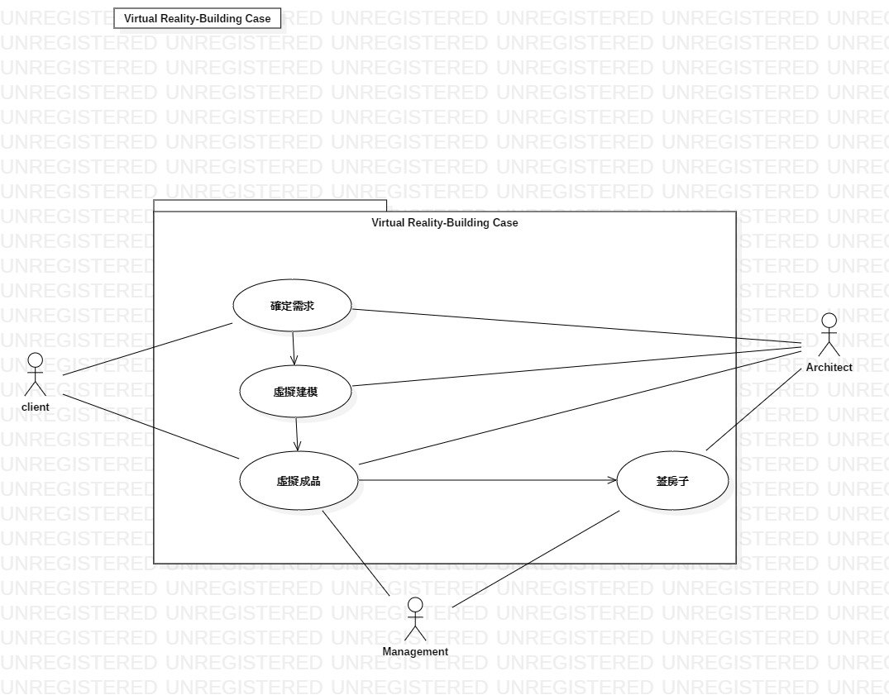
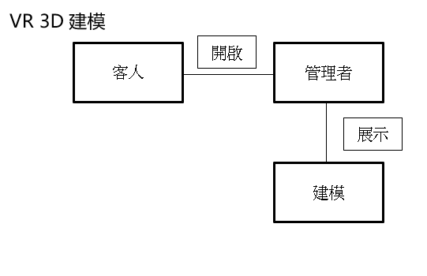
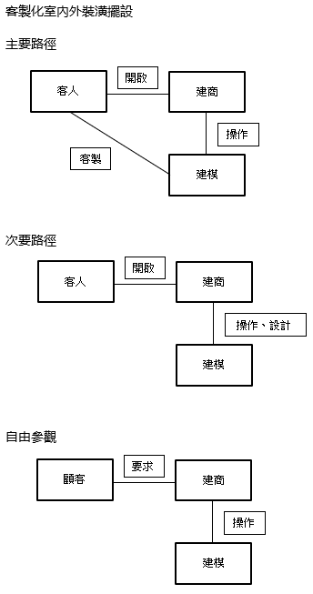
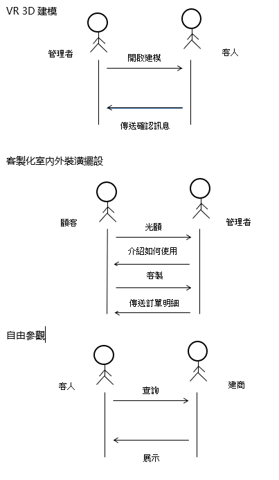

>1.專題題目
>>+ 房屋虛擬機

>2.文字敘述專題需求
>>有一天，小莫終於存到了人生第一桶金，想要買一棟有自己風格的房子，從外觀到內裝，他想到房屋虛擬機可以幫助他完成他自己風格的房子，他想通過VR設備來製作出屬於自己獨一無二的房子

>3.寫出專題之功能性需求與非功能性需求
>>專題之功能性需求
>>+ 3D化設計
>>+ 較為逼真
>>+ 可隨時修改

>>專題之非功能性需求
>>+ 可及時做出回復

>4.畫出 使用案例圖 (use case diagram)
>>

>5.由上而下 排出 使用案例的重要性
>>+ 可立即對房型進行修改
>>+ 可進行家具擺放
>>+ 可及時回傳於設計師

>6.寫出 其中的 至少三個使用案例
>>+ 
>>+ 
>>+ 

>7.寫出 user story
>>我們想透過房屋虛擬機來讓更多人可以擁有自己最獨特自己最喜歡的房型設計
